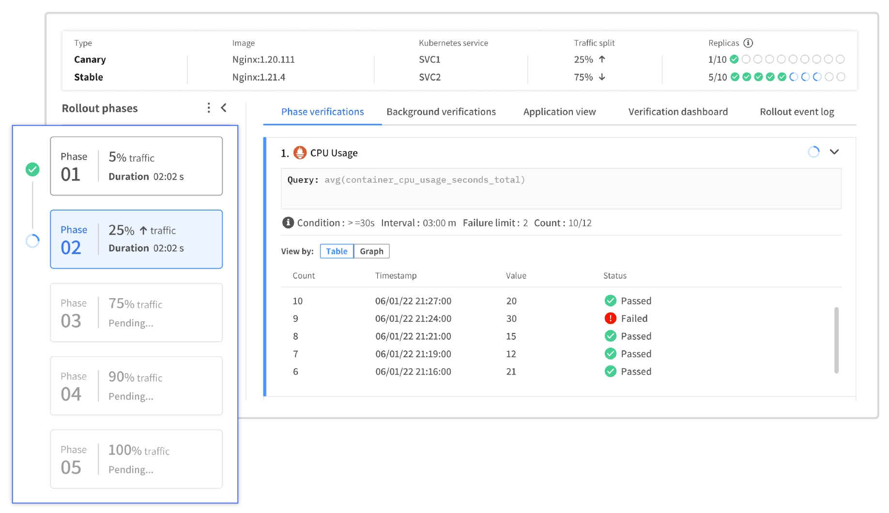

# Spot Ocean CD 

Ocean CD focuses on the most painful aspects of modern application delivery, giving developers the freedom to push code with confidence while DevOps easily maintain governance and SLOs.

Ocean CD provides DevOps and Infrastructure teams with the out-of-the-box processes to reimplement and share complex and mission critical pieces of CD across different environments, such as progressive delivery and verification of the software deployments. Service owners are able to promote service changes to production without code or re-inventing deployment strategies. Developers are able to commit with confidence, now that the deployment phases are managed and visible.

## Table of Contents

- [Prerequisites](#prerequisites)
- [Operator Installation](#Operator-installation)
- [Quick Start](#quick-start)
- [Documentation](#documentation)

To get more about our features use [this link](./examples/features).

## Prerequisites:

- Kubernetes cluster up and running (Azure, GCP, AWS)
- Workstation with the Kubernetes cluster context and kubectl installed
- Have an installed operator lifecycle manager ("OLM")
- [Spot API token](https://docs.spot.io/administration/api/create-api-token)

## Operator Installation

The Ocean CD Operator detects every applied SpotDeployment, monitors all of your resources, and manages rollouts based on the SaaS logic. Whenever the SpotDeployment is applied, the SaaS will trigger a rollout.

You may **install your operator** via API, UI or HELM.

> **Note**:
> No matter which method you will choose, during the installation, you will be required to update whether your cluster has an already installed Argo Rollout installation.
Indeed, Ocean CD recognizes the advantages of Argo rollouts as an engine for CD strategies and uses it accordingly to manage and enable it as a scalable CD product.

### Helm

We invite you to reach to the ["charts/spot-oceancd-operator"](./charts/spot-oceancd-operator) directory, and follow the tutorial provided. 

### API & UI Options

We invite you to reach out to [our documentation](https://docs.spot.io/ocean-cd/getting-started/install-operator-using-API-or-helm) for further details on the process and the commands.

## Quick Start

### Concepts
After installing the Ocean CD Operator in your cluster, you will set up **five** basic types of entities:

- Create a **SpotDeployment** custom resource - Ocean CD replacement of a Deployment resource.
- Define **Strategy** - An entity including a definition of phases that manage
the way your workload changes are being exposed in the desired
cluster and namespace.
- Define **RolloutSpec** - An entity including the CD strategy and traffic definitions 
for the selected SpotDeployment.
- Define **Verification Template** - An entity including the metrics you wish to perform while your rollout is in progress. 
  The verification template is a verification key entity which associates your arguments, queries as well as the monitoring tool of your choice. 
  Such entity is reusable and can be used and maintained over multiple services and clusters.
- Define **Verification Provider** - An entity including the credentials of the monitoring tool chosen for your cluster. 

### Steps towards your Canary deployment

To **easily get started** with Ocean CD, you may make use of the SpotDeployment [common example](./examples/common).
There you will find all the relevant templates to get started with Ocean CD and apply a Canary Deployment strategy for a demo NGINX application.

Follow the next steps:

1. Migrate your [deployment.yaml](examples/common/deployment.yaml) into a "SpotDeployment" custom resource by copying your deployment and change its "kind" to "SpotDeployment" and apiVersion to "spot.io/v1beta1" (see [spotDeployment.yaml](examples/common/spotdeployment.yaml)).

> **Note**: Do not forget to update the namespace in which you plan to do the rollouts.

2. Apply and create your SpotDeployment. Please note that your first apply will create the new SpotDeployment pods (can be tracked via the console UI, "Workloads" page).

> **Note**: Any **first** Apply to your SpotDeployments will not trigger a rollout. Only the creation of the pods will be accomplished.
To trigger a rollout with the entities of your choice, you will need to apply any additional change to spec.template of the SpotDeployment.

3. Create [Canary](examples/common/canary_service.yaml) and [Stable](examples/common/stable_service.yaml) services that will be used to expose your canary and stable pods with the respective traffic.

> **Note**:
> All of your services, traffic managers resources and SpotDeployment YAMLs ought to be applied in the same namespace configured in your RolloutSpec.

4. Using API or UI create **Ocean CD entities** that manage your SpotDeployment rollout logic: Strategy, RolloutSpec, Verification Template & Verification Provider. See entities formats that can be used via API inside the [entities' folder](examples/supported_deployment_strategies).
   Make sure to use your Spot API token for authorization. For API documentation, see [here](https://api.spotinst.io/ocean/cd).

> **Note**:
> Make sure to use the same namespace and Cluster ID to which your SpotDeployment is applied.

5. Perform and apply changes to your SpotDeployment template' spec.

**_You are now all set to get working with Ocean CD!_**

### More examples?

Through files located in [this folder](./examples), you will find a series of examples which will accompany you through the process of a simplified and quick Canary Deployment.

## Documentation

For a complete Ocean CD documentation, see [Ocean CD documentation](https://docs.spot.io/ocean-cd/)

